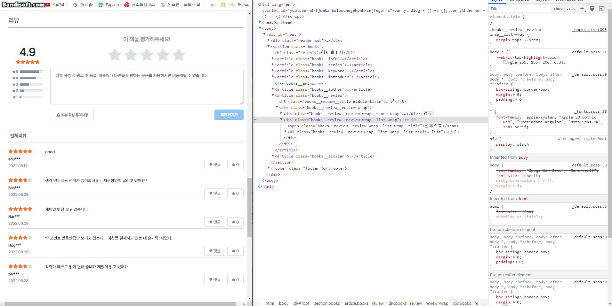
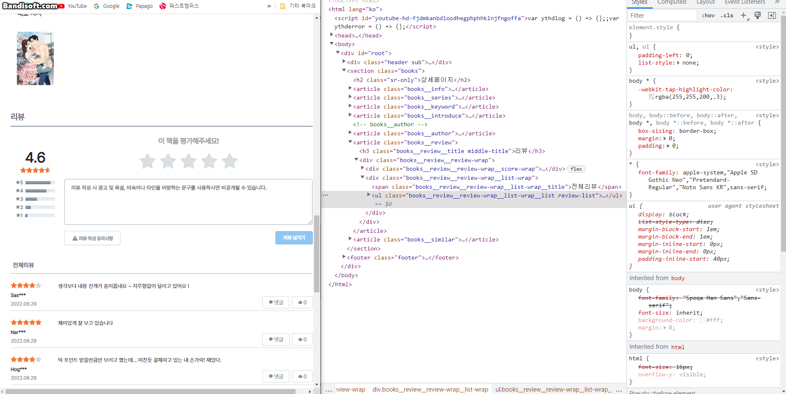

# 기존 팀 프로젝트에 아쉬웠던 부분을 추가한 버전입니다.

### 기존 팀 프로젝트 주소

https://github.com/jeong-se-hun/RIDIProject

### 수정 버전 실행 방법

1. npm i
2. npm start

### 프로젝트 설명

팀 프로젝트로 만든 COTAKU TOON 프로젝트에 라우터로 화면전환 시 변경 부분이 아닌 전체가 새로 렌더 되는 부분이 아쉬워서 화면전환 시 diff를 통해 변경된 부분만 랜더 될 수 있도록 변경했으며 오류 수정 및 웹 팩으로 최적화를 적용한 버전입니다.

#### 변경사항 디테일

1. render 시 이전 돔과 가상 돔을 비교하여 이전과 달라진 부분만 render
2. 일부 이벤트에서 이벤트 중복 발생 확인하여 수정
3. 웹팩 으로 빌드 및 이미지 리사이징으로 최적화
4. 오류 수정

#### diff 적용 전후 비교

|           diff 적용 전           |
| :------------------------------: |
|  |

|           diff 적용 후           |
| :------------------------------: |
|  |
